# FileExplorer

This is simple file explorer based on Qt.

## What is it like

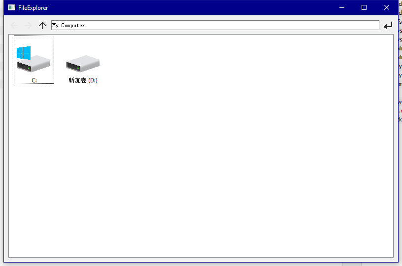    

## Right Click
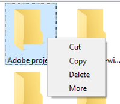    
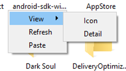                            

## Change View
Icon View:
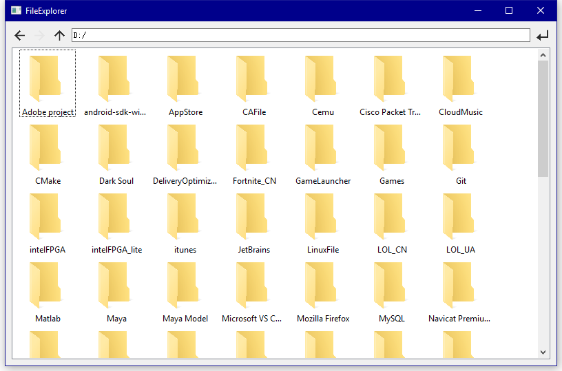    
Detail View(sortable):
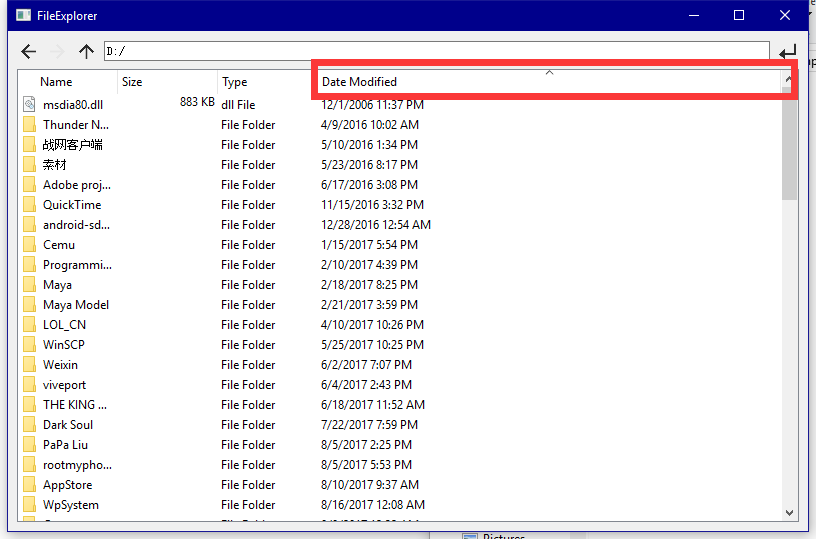    
## Copy/Cut/Delete/Paste Action

All Action supports multi-item. Beside, Cut and Copy and Paste are compatible with origin windows explorer.

## Drag and Drop
Only drag and drop is supported if the target is a folder or if the target is blank. The following way is supported: Drag and drop are both from the same FileExplorer's window; Drag from FileExplorer and Drop to others; Drag from FileExplorer and drop to origin windows explorer; Drag from origin windows explorer and drop to FileExplorer. The supported operations are: move operation and copy operation (Link operation is not supported at present). The default operation is the copy operation; In the Icon view, Shift+ drag can be used to move, and in the Detail view, Shift can be pressed while dragging to move.

## More Action
More Action can pop up windows shell context menu, and of cause it supports multi-item.
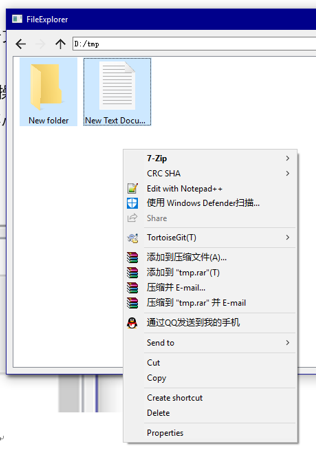    

## LAN

File Explorer supports windows shared file(LAN)
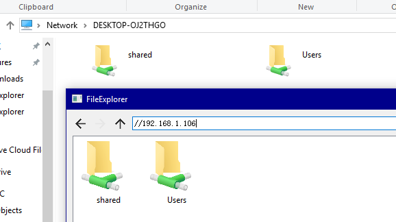     

## Rename
You can rename file if you click the selected file
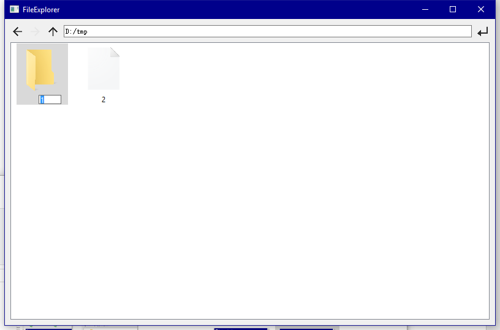    
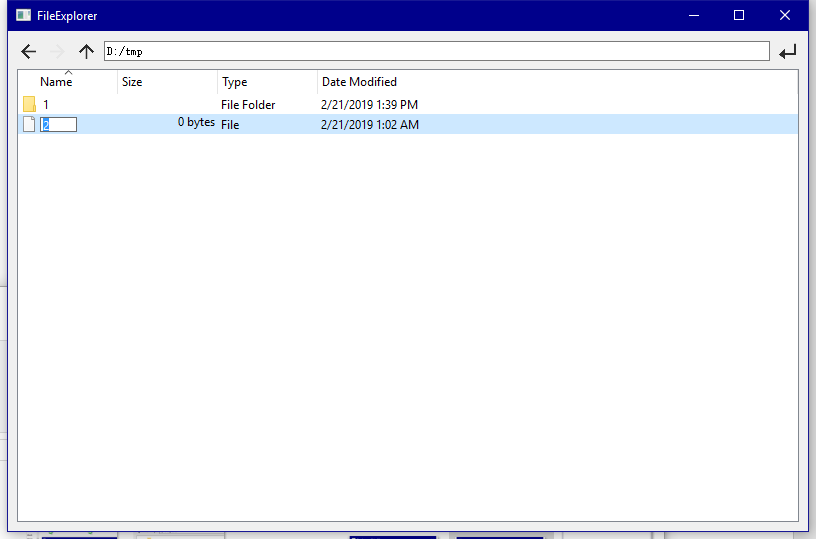   

## Error
Wrong url   
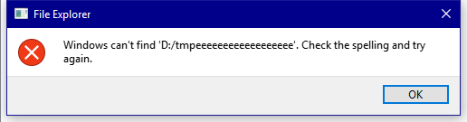   
The file name is same with a dir name   
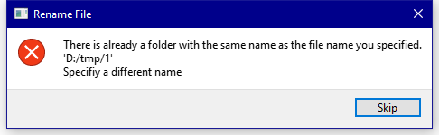   
The target file is exist   
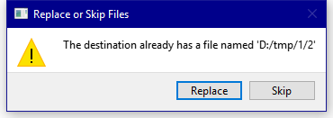   
Target folder is a sub folder of the source folder   
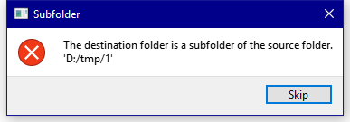   

## Some bugs
1. Disks with windows system compressed folders are slow to access for the first time
2. Access to nonexistent LAN paths will cause main thread blocked
3. You can edit file's Date Modified or something else in detail view(but it will be never worked :) )
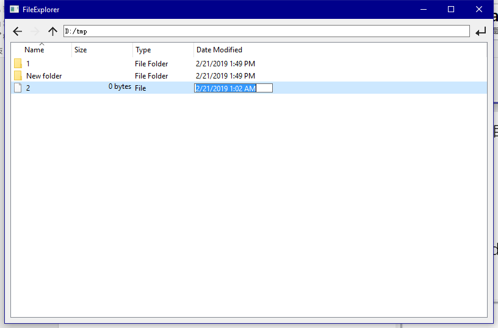   
4. You can't access the shared folder using the host name(Windows can). It seems to a Qt bug because the QDir is existed but cannot accessed
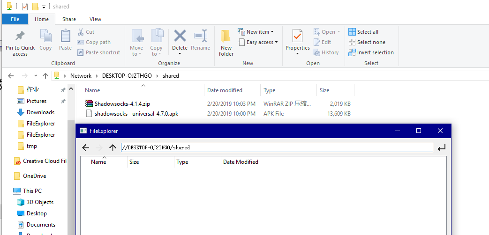   
